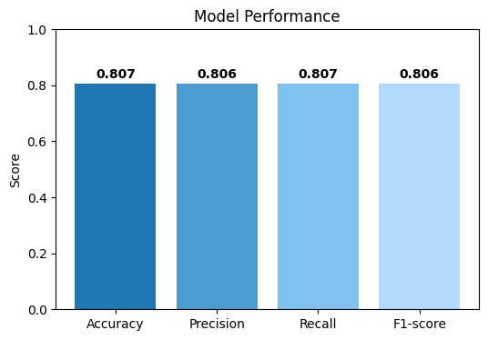

# 🚢 Titanic Survival Prediction
Simple ML project about Titanic survival prediction using Random Forest, which show cases basic data processing and model evaluation.

## Prerequisite
To run this project, ensure you have the following installed:
  1. Python 3.7+
  2. Required Python packages
     
    pip3 install pandas matplotlib 
    pip3 install scikit-learn 
    pip3 install seaborn

  3. Required library imports (given the code)

## Result
The model performance is shown in the evaluation metrics below

  

## Dataset 
The dataset was from https://github.com/datasciencedojo/datasets/blob/master/titanic.csv.
Several preprocessing for the dataset was needed, such as

1. Mapping textual data ('Sex' & 'Embarked') to numerical values.
2. Checking for NaN values and fill the values using the _mean()_ function, such as for 'Age'.
3. Selecting relevant features along with the target value.

## Contribution
Contributions are welcome! If you’d like to improve this model:

1. Fork the repository.
2. Create a new branch.
3. Add or update Python scripts for better/improved accuracy.
4. Submit a pull request.
